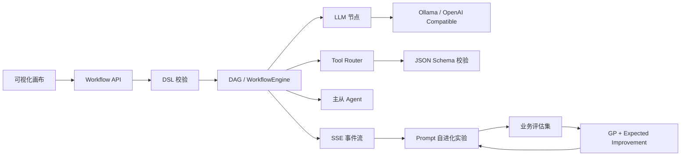

# AgentFlow Platform

> 企业级多 Agent 自进化工作流编排平台 MVP


AgentFlow 把可视化 DAG、LLM、工具、主从 Agent 和 Prompt 自进化放进同一个可运行闭环：工作流可以保存、发布、执行、观测，并基于业务评估集自动比较和选择更好的 Prompt。

## 效果先看

在本机 RTX 4060 Laptop 8GB + Ollama `qwen3:1.7b` 上完成 12 条业务任务 A/B 实验：

| 指标 | Baseline Prompt | Optimized Prompt | 变化 |
|---|---:|---:|---:|
| 任务准确率 | 58.3% | 58.3% | 持平 |
| 严格 Exact Match | 0.0% | 25.0% | +25pp |
| 平均输出 Token | 712.9 | 52.0 | -92.7% |
| 平均延迟 | 5978ms | 414ms | -93.1% |

这组结果说明：MVP 的 Prompt 自优化首先稳定改善了输出格式、推理成本和响应延迟；准确率仍需要更强模型、更大评估集和验证/修复循环继续提升。所有结果都可用脚本复现。

## 核心链路



## 已实现能力

- DAG DSL 解析、拓扑排序、循环/不可达检测
- `INIT / MARK / RUNNING / SUCCESS / ERROR / SKIP` 状态机
- DAG 节点级并行、超时、取消和事件记录
- LLM、Tool、Agent、Start、End 五类节点
- OpenAI 兼容 Provider，可接 Ollama、DeepSeek、通义等
- Tool Router：词法召回 + Ollama 语义精排 + JSON Schema 校验
- 多工具并行执行和失败隔离
- 主从 Agent 并行调度
- Prompt 规则变异和模型驱动变异
- TF-IDF Embedding 基线、Ollama Embedding 接口
- Gaussian Process + Expected Improvement
- JSON/SQLite/PostgreSQL Repository
- SSE 运行事件、RBAC、审计日志、Docker Compose

## 快速运行

### 1. 启动 Ollama

```powershell
ollama serve
ollama run qwen3:1.7b
```

### 2. 运行测试

```powershell
cd D:\agent-workflow-platform\backend
$env:PYTEST_DISABLE_PLUGIN_AUTOLOAD="1"
$env:PYTHONPATH="D:\agent-workflow-platform\backend\src"
python -m pytest -q
```

### 3. 运行 Prompt A/B 实验

```powershell
cd D:\agent-workflow-platform
$env:PYTHONPATH="D:\agent-workflow-platform\backend\src"
python examples\prompt_ab_experiment.py
```

结果文件：`evaluation/results/prompt_ab_latest.json`。

### 4. 启动 API 和前端

```powershell
cd D:\agent-workflow-platform\backend
$env:PYTHONPATH="D:\agent-workflow-platform\backend\src"
python -m agentflow.api
```

然后打开 `frontend/index.html`。

## 评估与研究记录

- [Prompt A/B 对比实验](docs/prompt-ab-experiment.md)
- [Prompt 自进化分析](docs/evolution-analysis.md)
- [真实业务评估集](evaluation/business_eval.json)
- [BFCL 外部工具调用评估](docs/external-evaluation.md)
- [Ollama 本地推理](docs/ollama.md)
- [系统主规格](specs/00-main-spec.md)

## 项目结构

```text
backend/src/agentflow/
├── core/          # DAG 与 WorkflowEngine
├── nodes/         # LLM / Tool / Agent 节点
├── providers/     # Ollama / OpenAI-compatible Provider
├── tools/         # Tool Router / Schema / 并行执行
├── agents/        # 主从 Agent 调度
├── optimization/  # Prompt 变异 / Embedding / GP 优化
├── service/       # 工作流服务与持久化
└── security/      # RBAC / 审计 / 指标
```

## 下一步

1. 增加 30～50 条 train/validation 分离的企业任务。
2. 加入模型验证器和失败自动修复循环，提升准确率。
3. 使用 BFCL 多函数/并行/多轮数据继续验证 Tool Router。
4. 接入 Prometheus、OpenTelemetry 和生产级 OIDC/JWT。

项目定位是可解释、可复现的工程型 MVP：不仅展示架构，也保留测试、外部基准和真实本地模型实验结果。
