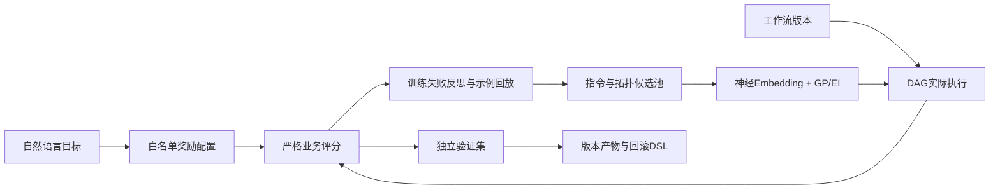

# AgentFlow · Workflow Evolution Lab

> 让工作流从失败轨迹中学习，以独立验证决定是否发布下一代。

Python · DAG · Ollama · Reflective Mutation · Neural Embedding · GP/EI

[算法协议](docs/evolution-protocol.md) · [SafeFlow-Evo 论文规格](specs/11-safeflow-evo-paper.md) · [实验结论](docs/evolution-results.md) · [方法调研](docs/research-optimization-2026.md) · [数据](evaluation/triage_v1.json) · [核心实现](backend/src/agentflow/optimization/evolution.py)

## 项目故事

企业工单中的“无法登录”可能是个人账户问题，也可能是全员故障；同时提到退款和异常登录时，还需要按规则确定优先级。合法 JSON 不代表正确业务决策。

AgentFlow 将执行、评估、失败反馈、候选变异、有限预算搜索与验证选版连起来。进化对象包含节点指令、训练经验示例与受限 DAG 拓扑；模型权重不变。结构搜索可在单节点、路由/优先级双专家、初判后复核之间选版，不等同于任意图生成。

## 算法闭环



## 如何验证

固定模型、业务规则和执行参数，对比固定指令、反馈随机搜索、反馈 GP/EI，并加入固定 few-shot 基线。每轮生成三个候选，只评估两个；两轮共评估四个新候选。测试集不参与变异或选版。

数据为 **48 条自建模拟工单**：12 训练 / 12 验证 / 24 测试，同一业务规则下样本互不重复。不是客户生产数据，也不是 BFCL 官方测评。报告包含原始输出、候选谱系、输入/输出 Token、失败实验和统计区间。

早期十二条样本的手工 A/B 和 BFCL 全局词法检索是探索性实验，不能作为自进化算法收益证据。当前结论以[新实验报告](docs/evolution-results.md)为准。

**当前结果：闭环可运行，收益尚不稳定。** 早期一轮冻结版本在新增模拟工单上由固定指令的 37.5% 提升至 66.7%，另一种子低于静态 few-shot。在两个固定候选池的 4 次预算实验里，“文本+拓扑”GP 均找到训练最优；最新 SafeFlow-Evo 开发池中混合 GP 以 6 次预算命中 83.3% 的安全最优，冻结确认池却没有任何安全改进候选。BFCL-derived 公开数据 pilot 中，失败反馈 warm-start 在开发/验证达到 95%/95%，但冻结确认从基线 91.7% 退化为 90.0%，发布门自动拒绝并回滚；第二个独立切分的开发集已饱和为 100%，三种方法验证均为 92.5%，因此保持确认集封存。现有证据支持结构特征、失败反思和安全拒绝机制，但不足以声称论文级显著优势。

进一步参考 GEPA/MIPRO 做了实例级 Pareto 合并和 instruction × demo 联合搜索。Pareto merge 暴露出 mini-batch 过拟合并被发布门槛拒绝；联合搜索候选在确认样本达到 62.5%–70.8%，相对同轮 41.7% 基线提升 20.8–29.1 个百分点。三次重复验证与 route/priority 切片门控只允许其中一个候选发布，避免仅凭 12 条验证样本均值上线。

## 复现

先运行 Ollama 服务，再在项目根目录执行：

```powershell
ollama pull qwen3:1.7b
ollama pull nomic-embed-text
python examples/evolve_workflow.py --embedding nomic --failure-replay --output evaluation/results/my-run
python evaluation/analyze_evolution.py evaluation/results/my-run
python evaluation/compare_static.py evaluation/results/my-run
python evaluation/analyze_evolution.py evaluation/results/my-run

# 结构自进化：4B 负责变异，所有执行臂仍固定使用 1.7B
ollama pull qwen3:4b
python examples/evolve_structure.py --teacher-model qwen3:4b --seed 17 --output evaluation/results/my-structure-run
python evaluation/analyze_structure.py evaluation/results/my-structure-run
python evaluation/confirm_frozen.py evaluation/results/my-structure-run
python evaluation/verify_evidence.py

# 固定候选池、四次评估预算的 acquisition 消融
python evaluation/benchmark_acquisition.py evaluation/results/my-structure-run `
  --output evaluation/results/my-acquisition/acquisition.json --budget 4

# GEPA 风格安全合并，以及 MIPRO 风格 instruction × demos 联合搜索
python examples/evolve_pareto_merge.py evaluation/results/my-acquisition/acquisition.json `
  --output evaluation/results/my-pareto-run --frontier hybrid
python examples/evolve_joint_instruction_demo.py evaluation/results/my-acquisition/acquisition.json `
  --output evaluation/results/my-joint-run --budget 6
python evaluation/audit_release_stability.py evaluation/results/my-joint-run
```

使用新输出目录以保留历史证据。核心实验仅调用本地模型；目标 Python 版本为 3.11+。

```powershell
$env:PYTHONPATH="$PWD/backend/src"
$env:PYTEST_DISABLE_PLUGIN_AUTOLOAD="1"
python -m pytest backend/tests -q
```

## 已实现与边界

| 模块 | 状态 |
|---|---|
| 进化算法 | 严格奖励、模型反馈变异、示例回放、受限拓扑搜索、GP/EI、验证选版和回滚产物 |
| DAG | Kahn排序、DFS环检测、串行/分层并行 |
| 模型与向量 | Ollama Qwen3、nomic-embed-text；TF-IDF消融选项 |
| 工具/Agent | 注册、路由、线程池原型；未完成自主主从规划 |
| UI/API | 可视化与HTTP原型，API部分节点仍用模拟处理器 |
| SSE | 旧实现是执行后回放，尚非实时执行流 |
| 超时/取消 | 线程级协作原型，不能强杀阻塞插件 |
| 存储/鉴权 | 基础适配和测试，尚非生产验收 |

Java双引擎、Kafka、Redis、完整租户隔离与生产恢复尚未交付。演示应聚焦可复现的算法实验。

## 研究参考

[ProTeGi](https://arxiv.org/abs/2305.03495) 提供训练错误反馈思路；[GEPA](https://arxiv.org/abs/2507.19457) 提供执行轨迹反思与变异思路。本项目是独立简化实现，不声称复现论文性能。
